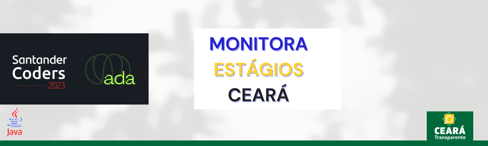
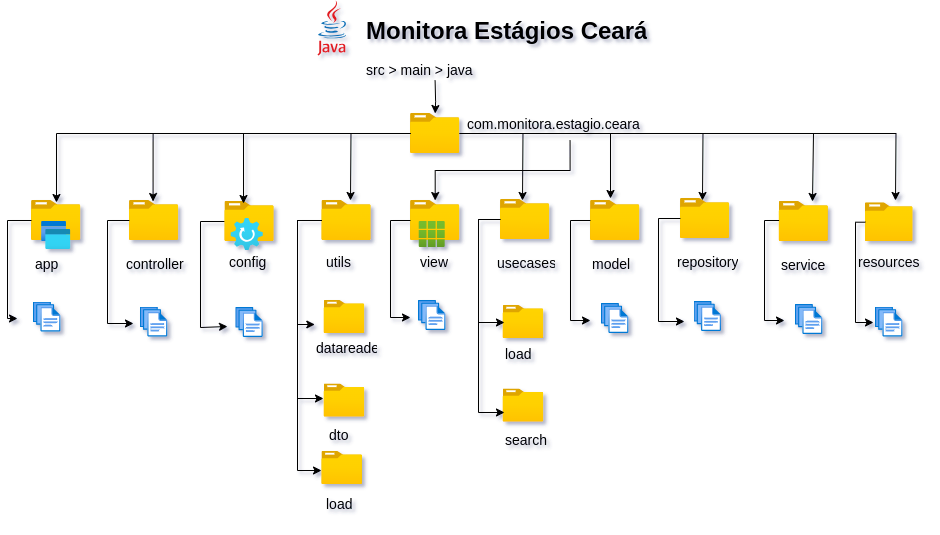
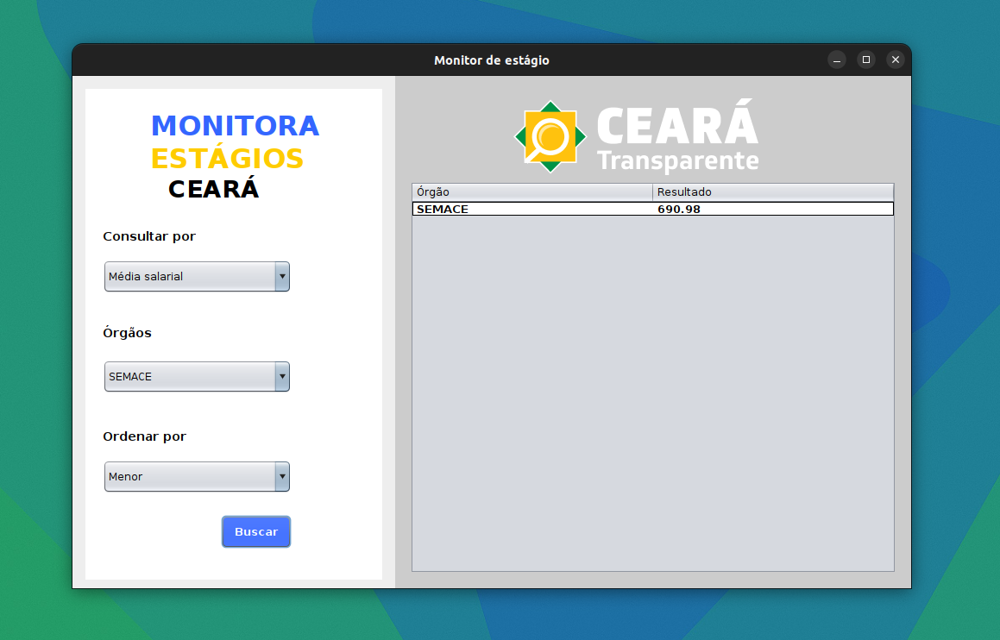

   

&nbsp;

# Monitora Estagios Ceará - JAVA APP ☕
O projeto * Monitora Estagios Cearáa* é uma aplicação em Java desenvolvida como parte de um sistema de consulta de estágios em órgãos públicos do Ceará. A aplicação tem como objetivo principal facilitar o processo de consulta de estágios em órgãos do Estado, melhorando a experiência para pessoas que desejam obter dados rapidamente e de maneira filtrada.

- <a href="#intro">Introdução</a>
- <a href="#arq">Arquitetura de Pastas do projeto</a>
- <a href="#meto">A metodologia</a>
- <a href="#demo">Demonstração do APP</a>
- <a href="#fluxo">Fluxo para consultar número de contratação</a>
- <a href="#acao">Ações</a>
- <a href="#front">Interface - Java Swing</a>

## Introdução ☕

Ao longo do módulo de Técnicas de Programação, nos aprofundamos nos conceitos e aplicações envolvendo Programação Funcional e Paralela, Stream, Optional, operadores intermediários, e terminais além de Datas e java.time.
Aqui você vai encontrar a resolução do projeto final, onde desenvolvemos uma aplicação utilizando os novos conhecimentos adquiridos.

## Arquitetura de Pastas do projeto ☕

   

 Figura: Organização de pastas do projeto na data de 08/04/24

## A Metodologia ☕

   

 Figura: Quadro de tarefas do projeto

Foi utilizada uma abordagem de resolução de problemas e desenvolvimento de software.

Algumas etapas do desenvolvimento foram:

**1. Entendimento do problema:** Procuramos entender os requisitos do negócio e os objetivos a serem alcançados.

**2. Planejamento:** Dividimos o problema em partes menores e mais gerenciáveis. Isso ajudou a abordar cada etapa de forma mais eficaz.

**3. Escolha da metodologia de desenvolvimento:** Metodologias ágeis, usamos um quadro Kanban do Github projects, para lidar com organização e autogerenciamento.

**4. Implementação e Desenvolvimento:** A escolha das ferramentas adequadas para implementar a solução foi a mesma utilizada nos módulos anteriores: IntelliJ, Maven e Java 21. Além disso,  decidimos incluir mais um desafio como parte deste projeto para nosso aprendizados e experiência, que foi fazer implementações do Java Swing para criar um experiência mais agradável ao usuário. Utilizamos dados retirados da plataforama Ceará transparente. Cada csv utiliza uma thread para leitura.

**5. Documentação:** A documentação consiste na escrita deste README mantendo registros detalhados do processo de desenvolvimento, incluindo decisões, problemas encontrados e soluções implementadas e também este [documento de requisitos](https://docs.google.com/document/d/1g_un9bowROQZlsKhvoS9jDy1s0Kkgv37IYJxxCDf-AY/edit?usp=sharing) utilizado durante as reuniões de planning.

**6. Comunicação:** Fizemos dailys e reuniões regulares para assegurar que a solução proposta atendesse às expectativas do negócio.

🧰 Ferramentas úteis:

- Controle de versão:  Git. Também utilizamos Gitflow durante o desenvolvimento.
- Ambientes de Desenvolvimento Integrado -(IDEs): Visual Studio Code e IntelliJ.
- Plataformas de Gerenciamento de Projetos: - Github Projects.
- outros: Miro, Draw.io.

(<a href="#readme-top">Voltar ao topo</a>)

## Demonstração da Aplicação ☕

 

  

 Figura: Demonstração da aplicação

## Fluxo para consultar número de contratação ☕

  

 Figura: Fluxo para consultar número de contratação

## Ações ☕

<h3>
Consultar número de contratação
</h3>

|Ação  | Descrição | Requer                         
--------------------------------------------------------------------------------------------------------------|------------|------------------------------|
| Consulta por contratação           | `CONSULTA`    | TODOS ÓRGÃOS   |
| Consulta por contratação                 | `CONSULTA`      | ÓRGÃO ESPECIFICO  | 
| Ordenação ascendente          | `ORDENA`    | TODOS ÓRGÃOS   |
| Ordenação descendente            | `ORDENA`    | TODOS ÓRGÃOS  |

<h3>
   Consultar por média salarial
</h3>

| Ação     | Descrição | Requer Tipo de Veículo                         
|--------------------------------------------------------------------------------------------------------------|------------|------------------------------|
| Consultar por média salarial               | `CONSULTA`     | TODOS ÓRGÃOS    |
| Consultar por média salarial               | `CONSULTA`      | ÓRGÃO ESPECIFICO    | 
| Ordenação ascendente                       | `ORDENA`    | TODOS ÓRGÃOS    |
|Ordenação descendente                    | `ORDENA`    | TODOS ÓRGÃOS   |

----------------------------------------------------------------------------------------------

(<a href="#readme-top">Voltar ao topo</a>)

##  Frontend: Java Swing ☕

Como já mencionado, utilizamos o  Java Swing, que é uma biblioteca de componentes de interface gráfica (GUI) para Java. Utilizamos alguns componentes e fizemos alguns personalizados. Foi interessante ver a flexibilidade e o comportamento dos componentes Swing.

### Telas
Algumas telas desenvolvidas:

 

### Dados

Os dados utilizados como fonte compreendem 4 conjuntos de dados no formato CSV obtidos da plataforma [Ceará Transparente](https://cearatransparente.ce.gov.br/portal-da-transparencia/servidores?locale=pt-BR&__=__). Foram selecionados dados abrangendo o período de 2021 a 2024, os quais foram organizados e compilados por ano.

### Pastas

Por padrão, estamos usando a pasta `view` para armazenar e manipularmos as interfaces e implementações referentes ao frontend.

## 🤝 Colaboradores

<table align="center"><tr>
 <td align="center"><a href="https://github.com/fernandacostads" target="_blank">
     
    <b>Fernanda Costa</b></a>

 

</td>
    <td align="center"><a href="https://github.com/ma-elissa" target="_blank">
     
    <b>Maria Elissa</b></a>

 

</td>
  </tr>
</table>

## 😄 Seja um dos contribuidores!
Quer fazer parte desse projeto? Para contribuir, siga estas etapas:

1. Bifurque este repositório.
2. Crie um branch: git checkout -b <nome_branch>.
3. Faça suas alterações e confirme-as: git commit -m '<mensagem_commit>'
4. Envie para o branch original: git push origin <nome_do_projeto> / <local_>
5. Crie a solicitação de pull.

Como alternativa, consulte a documentação do GitHub em como criar uma solicitação pull.
Clique [AQUI](https://opensource.guide/how-to-contribute/) e leia como contribuir.

## 📝 Licença
Esse projeto está sob licença. Veja o arquivo [LICENÇA](https://github.com/fernandacostads/monitora-estagios-ceara/blob/main/LICENSE.md) para mais detalhes.

(<a href="#readme-top">Voltar ao topo</a>)

Copyright © 2024 | Monitora Estagios Cearaá by Fernanda Costa e Maria Elissa
